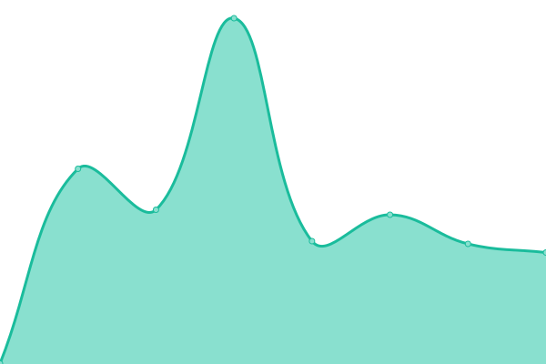

# [📈 Live Status](https://status.relevantleads.io): <!--live status--> **🟩 All systems operational**

This repository contains the open-source uptime monitor and status page for [aibofobia67](https://status.relevantleads.io), powered by [Upptime](https://github.com/upptime/upptime).

With [Upptime](https://upptime.js.org), you can get your own unlimited and free uptime monitor and status page, powered entirely by a GitHub repository. We use [Issues](https://github.com/aibofobia67/status/issues) as incident reports, [Actions](https://github.com/aibofobia67/status/actions) as uptime monitors, and [Pages](https://status.relevantleads.io) for the status page.

<!--start: status pages-->
<!-- This summary is generated by Upptime (https://github.com/upptime/upptime) -->
<!-- Do not edit this manually, your changes will be overwritten -->
<!-- prettier-ignore -->
| URL | Status | History | Response Time | Uptime |
| --- | ------ | ------- | ------------- | ------ |
|  [Plataforma Relevant](https://app.relevantleads.io/api/health) | 🟩 Up | [plataforma-relevant.yml](https://github.com/aibofobia67/status/commits/HEAD/history/plataforma-relevant.yml) | 

 692ms
     
 | 

<a href="https://status.relevantleads.io/history/plataforma-relevant">100.00%</a>
    

|  [IA de Relevant](https://app.relevantleads.io/api/health/ai) | 🟩 Up | [ia-de-relevant.yml](https://github.com/aibofobia67/status/commits/HEAD/history/ia-de-relevant.yml) | 

 584ms
     
 | 

<a href="https://status.relevantleads.io/history/ia-de-relevant">100.00%</a>
    

|  [WhatsApp Mensajería](https://app.relevantleads.io/api/health/whatsapp) | 🟩 Up | [whats-app-mensajeria.yml](https://github.com/aibofobia67/status/commits/HEAD/history/whats-app-mensajeria.yml) | 

 131ms
     
 | 

<a href="https://status.relevantleads.io/history/whats-app-mensajeria">100.00%</a>
    

|  [Suscripciones y Pagos](https://app.relevantleads.io/api/health/payments) | 🟩 Up | [suscripciones-y-pagos.yml](https://github.com/aibofobia67/status/commits/HEAD/history/suscripciones-y-pagos.yml) | 

 216ms
     
 | 

<a href="https://status.relevantleads.io/history/suscripciones-y-pagos">100.00%</a>
    

|  [Facturación CFDI](https://app.relevantleads.io/api/health/invoicing) | 🟩 Up | [facturacion-cfdi.yml](https://github.com/aibofobia67/status/commits/HEAD/history/facturacion-cfdi.yml) | 

 404ms
     
 | 

<a href="https://status.relevantleads.io/history/facturacion-cfdi">97.67%</a>
    

|  [Notificaciones por Email](https://app.relevantleads.io/api/health/email) | 🟩 Up | [notificaciones-por-email.yml](https://github.com/aibofobia67/status/commits/HEAD/history/notificaciones-por-email.yml) | 

 153ms
     
 | 

<a href="https://status.relevantleads.io/history/notificaciones-por-email">100.00%</a>
    

|  [Captación de Leads](https://app.relevantleads.io/api/health/capture) | 🟩 Up | [captacion-de-leads.yml](https://github.com/aibofobia67/status/commits/HEAD/history/captacion-de-leads.yml) | 

 263ms
     
 | 

<a href="https://status.relevantleads.io/history/captacion-de-leads">100.00%</a>
    

|  [Sitio Web](https://www.relevantleads.io) | 🟩 Up | [sitio-web.yml](https://github.com/aibofobia67/status/commits/HEAD/history/sitio-web.yml) | 

 249ms
     
 | 

<a href="https://status.relevantleads.io/history/sitio-web">100.00%</a>
    

|  [Centro de Ayuda](https://support.relevantleads.io) | 🟩 Up | [centro-de-ayuda.yml](https://github.com/aibofobia67/status/commits/HEAD/history/centro-de-ayuda.yml) | 

 471ms
     
 | 

<a href="https://status.relevantleads.io/history/centro-de-ayuda">100.00%</a>
    

<!--end: status pages-->

[**Visit our status website →**](https://status.relevantleads.io)

## 📄 License

- Powered by: [Upptime](https://github.com/upptime/upptime)
- Code: [MIT](./LICENSE) © [Anand Chowdhary](https://anandchowdhary.com), supported by [Pabio](https://pabio.com)
- Data in the `./history` directory: [Open Database License](https://opendatacommons.org/licenses/odbl/1-0/)
